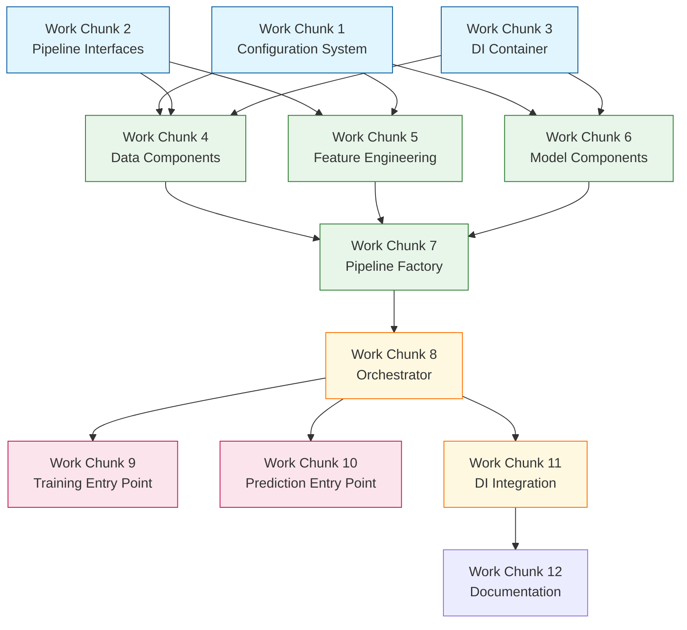

# NexusML Refactoring Work Plan

This document breaks down the refactoring suggestions into discrete work chunks
that can be assigned to different team members. Each work chunk is designed to
be:

1. **Self-contained** - Can be worked on independently
2. **Incremental** - Maintains pipeline functionality throughout
3. **Testable** - Has clear success criteria
4. **Efficient** - Minimizes rework and conflicts

## Work Chunk 1: Configuration System Foundation

**Objective**: Create the core configuration system without modifying existing
code.

**Assignee Role**: Configuration System Specialist

**Tasks**:

1. Create `nexusml/core/config/configuration.py` with the `NexusMLConfig` class
2. Create `nexusml/core/config/provider.py` with the `ConfigurationProvider`
   class
3. Create a template configuration file that mirrors current settings
4. Write unit tests for the configuration system
5. Create a migration script to generate a unified config from existing files

**Dependencies**: None (can start immediately)

**Testing Criteria**:

- Unit tests for configuration loading and validation pass
- Migration script successfully converts existing configs to new format
- No changes to existing code paths yet

**Estimated Effort**: Medium (3-5 days)

## Work Chunk 2: Pipeline Interfaces

**Objective**: Define the interfaces for pipeline components without modifying
existing implementations.

**Assignee Role**: Architecture Specialist

**Tasks**:

1. Create `nexusml/core/pipeline/interfaces.py` with all interface definitions
2. Document interface contracts and responsibilities
3. Create skeleton implementations that delegate to existing code
4. Write unit tests for interface contracts

**Dependencies**: None (can start immediately)

**Testing Criteria**:

- Interface definitions are complete and well-documented
- Skeleton implementations pass interface contract tests
- No changes to existing code paths yet

**Estimated Effort**: Small (2-3 days)

## Work Chunk 3: Dependency Injection Container

**Objective**: Create the DI container system without modifying existing code.

**Assignee Role**: Infrastructure Specialist

**Tasks**:

1. Create `nexusml/core/di/container.py` with the `DIContainer` class
2. Create `nexusml/core/di/provider.py` with the `ContainerProvider` class
3. Write unit tests for the DI system
4. Create utility functions for registering existing components

**Dependencies**: None (can start immediately)

**Testing Criteria**:

- DI container can register and resolve dependencies
- Container provider works as a singleton
- Unit tests for DI system pass
- No changes to existing code paths yet

**Estimated Effort**: Small (2-3 days)

## Work Chunk 4: Configuration Integration - Data Components

**Objective**: Update data loading and preprocessing components to use the new
configuration system.

**Assignee Role**: Data Pipeline Specialist

**Tasks**:

1. Create adapter classes that use the new configuration system but maintain the
   existing API
2. Update `load_and_preprocess_data()` to use the configuration provider
3. Create a new `StandardDataLoader` class implementing the `DataLoader`
   interface
4. Create a new `StandardDataPreprocessor` class implementing the
   `DataPreprocessor` interface
5. Write integration tests for the updated components

**Dependencies**: Work Chunks 1 and 2

**Testing Criteria**:

- Existing code continues to work with the adapter pattern
- New components correctly use the configuration system
- Integration tests pass with both old and new code paths
- Data loading and preprocessing produce identical results with old and new code

**Estimated Effort**: Medium (3-4 days)

## Work Chunk 5: Configuration Integration - Feature Engineering

**Objective**: Update feature engineering components to use the new
configuration system.

**Assignee Role**: Feature Engineering Specialist

**Tasks**:

1. Create adapter for `GenericFeatureEngineer` that uses the new configuration
   system
2. Create new feature engineering components implementing the interfaces
3. Update feature transformers to use the configuration provider
4. Write integration tests for the updated components

**Dependencies**: Work Chunks 1 and 2

**Testing Criteria**:

- Existing code continues to work with the adapter pattern
- New components correctly use the configuration system
- Integration tests pass with both old and new code paths
- Feature engineering produces identical results with old and new code

**Estimated Effort**: Medium (4-5 days)

## Work Chunk 6: Configuration Integration - Model Components

**Objective**: Update model building, training, and evaluation components to use
the new configuration system.

**Assignee Role**: Model Pipeline Specialist

**Tasks**:

1. Create adapters for model building functions that use the new configuration
   system
2. Create new model components implementing the interfaces
3. Update model-related functions to use the configuration provider
4. Write integration tests for the updated components

**Dependencies**: Work Chunks 1 and 2

**Testing Criteria**:

- Existing code continues to work with the adapter pattern
- New components correctly use the configuration system
- Integration tests pass with both old and new code paths
- Model building, training, and evaluation produce identical results with old
  and new code

**Estimated Effort**: Medium (4-5 days)

## Work Chunk 7: Pipeline Factory Implementation

**Objective**: Create the pipeline factory to instantiate components with proper
dependencies.

**Assignee Role**: Architecture Specialist

**Tasks**:

1. Create `nexusml/core/pipeline/factory.py` with the `PipelineFactory` class
2. Implement factory methods for all pipeline components
3. Write unit tests for the factory
4. Create utility functions for customizing the factory

**Dependencies**: Work Chunks 2, 3, 4, 5, and 6

**Testing Criteria**:

- Factory can create all pipeline components
- Components are properly configured with dependencies
- Unit tests for factory pass
- No changes to existing code paths yet

**Estimated Effort**: Small (2-3 days)

## Work Chunk 8: Pipeline Orchestrator Implementation

**Objective**: Create the pipeline orchestrator to coordinate component
execution.

**Assignee Role**: Pipeline Integration Specialist

**Tasks**:

1. Create `nexusml/core/pipeline/orchestrator.py` with the
   `PipelineOrchestrator` class
2. Implement orchestration methods for training, evaluation, and prediction
3. Write integration tests for the orchestrator
4. Create examples of using the orchestrator

**Dependencies**: Work Chunk 7

**Testing Criteria**:

- Orchestrator can execute the complete pipeline
- Results match the existing pipeline
- Integration tests pass
- Examples work as expected

**Estimated Effort**: Medium (3-4 days)

## Work Chunk 9: Entry Point Updates - Training Pipeline

**Objective**: Update the training pipeline entry point to use the new
architecture.

**Assignee Role**: Pipeline Integration Specialist

**Tasks**:

1. Create a new version of `train_model_pipeline.py` that uses the orchestrator
2. Implement command-line argument handling for the new pipeline
3. Ensure backward compatibility with existing scripts
4. Write integration tests for the new entry point

**Dependencies**: Work Chunk 8

**Testing Criteria**:

- New entry point produces identical results to the old one
- Command-line arguments work as expected
- Existing scripts continue to work
- Integration tests pass

**Estimated Effort**: Small (2-3 days)

## Work Chunk 10: Entry Point Updates - Prediction Pipeline

**Objective**: Update the prediction pipeline entry point to use the new
architecture.

**Assignee Role**: Pipeline Integration Specialist

**Tasks**:

1. Create a new version of `predict.py` that uses the orchestrator
2. Implement command-line argument handling for the new pipeline
3. Ensure backward compatibility with existing scripts
4. Write integration tests for the new entry point

**Dependencies**: Work Chunk 8

**Testing Criteria**:

- New entry point produces identical results to the old one
- Command-line arguments work as expected
- Existing scripts continue to work
- Integration tests pass

**Estimated Effort**: Small (2-3 days)

## Work Chunk 11: Dependency Injection Integration

**Objective**: Update components to use dependency injection.

**Assignee Role**: Infrastructure Specialist

**Tasks**:

1. Update `EquipmentClassifier` to use the DI container
2. Update pipeline components to use dependency injection
3. Register components with the container provider
4. Write integration tests for the DI-enabled components

**Dependencies**: Work Chunks 3, 4, 5, 6, and 8

**Testing Criteria**:

- Components can be instantiated through the DI container
- Results match the existing pipeline
- Integration tests pass
- Components can be easily swapped or extended

**Estimated Effort**: Medium (3-4 days)

## Work Chunk 12: Documentation and Examples

**Objective**: Create comprehensive documentation and examples for the new
architecture.

**Assignee Role**: Documentation Specialist

**Tasks**:

1. Update README with information about the new architecture
2. Create developer documentation for the new components
3. Create examples of customizing the pipeline
4. Create migration guides for existing code

**Dependencies**: All other work chunks

**Testing Criteria**:

- Documentation is clear and comprehensive
- Examples work as expected
- Migration guides are accurate and helpful

**Estimated Effort**: Medium (3-4 days)

## Integration Plan

To ensure the pipeline remains functional throughout the refactoring process,
follow this integration plan:

1. **Parallel Development**: Work Chunks 1, 2, and 3 can be developed in
   parallel as they don't modify existing code.

2. **Adapter Pattern**: Work Chunks 4, 5, and 6 use adapters to maintain
   backward compatibility while introducing new components.

3. **Feature Flags**: Implement feature flags to toggle between old and new code
   paths for testing.

4. **Incremental Integration**: Integrate changes in the following order:

   - Configuration system
   - Pipeline interfaces and components
   - Factory and orchestrator
   - Entry point updates
   - Dependency injection

5. **Continuous Testing**: Run integration tests after each integration step to
   ensure functionality is maintained.

-

## Dependency Graph

-

## Risk Mitigation

1. **Regression Testing**: Maintain a comprehensive test suite to catch
   regressions.

2. **Rollback Plan**: Each integration step should have a clear rollback plan.

3. **Feature Flags**: Use feature flags to easily switch between old and new
   code paths.

4. **Incremental Deployment**: Deploy changes incrementally to minimize risk.

5. **Code Reviews**: Conduct thorough code reviews for each work chunk.

## Coordination

1. **Daily Standup**: Brief daily meetings to coordinate work and identify
   blockers.

2. **Work Chunk Handoffs**: Clear handoff criteria between dependent work
   chunks.

3. **Integration Meetings**: Scheduled meetings for integrating completed work
   chunks.

4. **Documentation Updates**: Keep documentation updated as work progresses.

## Success Criteria

The refactoring is considered successful when:

1. All tests pass with the new architecture.
2. The pipeline produces identical results with the old and new code paths.
3. The codebase adheres to SOLID principles.
4. The configuration system is unified and validated.
5. Components can be easily extended or replaced.
6. Documentation is comprehensive and up-to-date.
