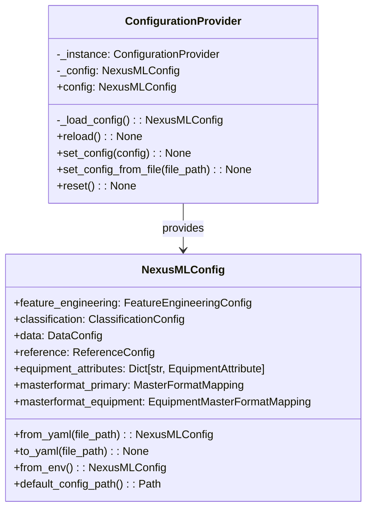

# NexusML Configuration System

## Introduction

The NexusML configuration system provides a unified approach to managing all
settings in the application. It centralizes configuration in a single file,
provides validation through Pydantic models, supports loading from YAML files or
environment variables, and ensures consistent access through a singleton
provider.

This document explains how the configuration system works, how to configure the
system, and provides examples of common configurations.

## Configuration Architecture

The configuration system consists of the following components:

1. **Configuration Models**: Pydantic models that define the structure and
   validation rules for configuration settings
2. **Configuration Provider**: A singleton class that provides access to the
   configuration
3. **Configuration Loading**: Mechanisms for loading configuration from files or
   environment variables

### Configuration Diagram



## Configuration Models

The configuration system uses Pydantic models to define the structure and
validation rules for configuration settings. The main configuration class is
`NexusMLConfig`, which contains all settings for the application.

### Main Configuration Class

```python
class NexusMLConfig(BaseModel):
    """Main configuration class for NexusML."""

    feature_engineering: FeatureEngineeringConfig = Field(
        default_factory=FeatureEngineeringConfig,
        description="Feature engineering configuration",
    )
    classification: ClassificationConfig = Field(
        default_factory=ClassificationConfig,
        description="Classification configuration",
    )
    data: DataConfig = Field(
        default_factory=DataConfig,
        description="Data preprocessing configuration",
    )
    reference: Optional[ReferenceConfig] = Field(
        None,
        description="Reference data configuration",
    )
    equipment_attributes: Dict[str, EquipmentAttribute] = Field(
        default_factory=dict,
        description="Equipment attributes configuration",
    )
    masterformat_primary: Optional[MasterFormatMapping] = Field(
        None,
        description="Primary MasterFormat mappings",
    )
    masterformat_equipment: Optional[EquipmentMasterFormatMapping] = Field(
        None,
        description="Equipment-specific MasterFormat mappings",
    )
```

### Feature Engineering Configuration

The `FeatureEngineeringConfig` class defines settings for feature engineering,
including text combinations, numeric columns, hierarchies, and column mappings.

```python
class FeatureEngineeringConfig(BaseModel):
    """Configuration for feature engineering."""

    text_combinations: List[TextCombination] = Field(
        default_factory=list, description="Text field combinations"
    )
    numeric_columns: List[NumericColumn] = Field(
        default_factory=list, description="Numeric column configurations"
    )
    hierarchies: List[Hierarchy] = Field(
        default_factory=list, description="Hierarchical field configurations"
    )
    column_mappings: List[ColumnMapping] = Field(
        default_factory=list, description="Column mapping configurations"
    )
    classification_systems: List[ClassificationSystem] = Field(
        default_factory=list, description="Classification system configurations"
    )
    direct_mappings: List[ColumnMapping] = Field(
        default_factory=list, description="Direct column mapping configurations"
    )
    eav_integration: EAVIntegration = Field(
        default_factory=lambda: EAVIntegration(enabled=False),
        description="EAV integration configuration",
    )
```

### Classification Configuration

The `ClassificationConfig` class defines settings for classification, including
classification targets and input field mappings.

```python
class ClassificationConfig(BaseModel):
    """Configuration for classification."""

    classification_targets: List[ClassificationTarget] = Field(
        default_factory=list, description="Classification targets"
    )
    input_field_mappings: List[InputFieldMapping] = Field(
        default_factory=list, description="Input field mapping configurations"
    )
```

### Data Configuration

The `DataConfig` class defines settings for data preprocessing, including
required columns and training data configuration.

```python
class DataConfig(BaseModel):
    """Configuration for data preprocessing."""

    required_columns: List[RequiredColumn] = Field(
        default_factory=list, description="Required columns configuration"
    )
    training_data: TrainingDataConfig = Field(
        default_factory=lambda: TrainingDataConfig(
            default_path="nexusml/data/training_data/fake_training_data.csv",
            encoding="utf-8",
            fallback_encoding="latin1",
        ),
        description="Training data configuration",
    )
```

### Reference Configuration

The `ReferenceConfig` class defines settings for reference data, including
paths, file patterns, column mappings, hierarchies, and defaults.

```python
class ReferenceConfig(BaseModel):
    """Configuration for reference data."""

    paths: PathConfig = Field(
        default_factory=lambda: PathConfig(
            omniclass="nexusml/ingest/reference/omniclass",
            uniformat="nexusml/ingest/reference/uniformat",
            masterformat="nexusml/ingest/reference/masterformat",
            mcaa_glossary="nexusml/ingest/reference/mcaa-glossary",
            mcaa_abbreviations="nexusml/ingest/reference/mcaa-glossary",
            smacna="nexusml/ingest/reference/smacna-manufacturers",
            ashrae="nexusml/ingest/reference/service-life/ashrae",
            energize_denver="nexusml/ingest/reference/service-life/energize-denver",
            equipment_taxonomy="nexusml/ingest/reference/equipment-taxonomy",
        ),
        description="Reference data paths",
    )
    file_patterns: FilePatternConfig = Field(
        default_factory=lambda: FilePatternConfig(
            omniclass="*.csv",
            uniformat="*.csv",
            masterformat="*.csv",
            mcaa_glossary="Glossary.csv",
            mcaa_abbreviations="Abbreviations.csv",
            smacna="*.json",
            ashrae="*.csv",
            energize_denver="*.csv",
            equipment_taxonomy="*.csv",
        ),
        description="Reference data file patterns",
    )
    column_mappings: ReferenceColumnMappings = Field(
        ..., description="Reference data column mappings"
    )
    hierarchies: HierarchiesConfig = Field(
        ..., description="Reference data hierarchy configurations"
    )
    defaults: DefaultsConfig = Field(
        default_factory=lambda: DefaultsConfig(service_life=15.0, confidence=0.5),
        description="Default values",
    )
```

## Configuration Provider

The `ConfigurationProvider` class is a singleton that provides access to the
configuration. It ensures that only one instance of the configuration is loaded
and used throughout the application.

```python
class ConfigurationProvider:
    """
    Singleton provider for NexusML configuration.

    This class implements the singleton pattern to ensure that only one instance
    of the configuration is loaded and used throughout the application.
    """

    _instance: Optional["ConfigurationProvider"] = None
    _config: Optional[NexusMLConfig] = None

    def __new__(cls) -> "ConfigurationProvider":
        """
        Create a new instance of ConfigurationProvider if one doesn't exist.

        Returns:
            ConfigurationProvider: The singleton instance
        """
        if cls._instance is None:
            cls._instance = super(ConfigurationProvider, cls).__new__(cls)
            cls._instance._config = None
        return cls._instance

    @property
    def config(self) -> NexusMLConfig:
        """
        Get the configuration instance, loading it if necessary.

        Returns:
            NexusMLConfig: The configuration instance

        Raises:
            FileNotFoundError: If the configuration file doesn't exist
            ValueError: If the configuration is invalid
        """
        if self._config is None:
            self._config = self._load_config()
        return self._config

    def _load_config(self) -> NexusMLConfig:
        """
        Load the configuration from the environment or default path.

        Returns:
            NexusMLConfig: The loaded configuration

        Raises:
            FileNotFoundError: If the configuration file doesn't exist
            ValueError: If the configuration is invalid
        """
        # Try to load from environment variable
        try:
            return NexusMLConfig.from_env()
        except ValueError:
            # If environment variable is not set, try default path
            default_path = NexusMLConfig.default_config_path()
            if default_path.exists():
                return NexusMLConfig.from_yaml(default_path)
            else:
                raise FileNotFoundError(
                    f"Configuration file not found at default path: {default_path}. "
                    "Please set the NEXUSML_CONFIG environment variable or "
                    "create a configuration file at the default path."
                )
```

## Configuration Loading

The configuration system supports loading configuration from YAML files or
environment variables.

### Loading from YAML Files

```python
# Load configuration from a YAML file
config = NexusMLConfig.from_yaml("path/to/config.yml")
```

### Loading from Environment Variables

```python
# Set the NEXUSML_CONFIG environment variable
os.environ["NEXUSML_CONFIG"] = "path/to/config.yml"

# Load configuration from the environment variable
config = NexusMLConfig.from_env()
```

### Default Configuration Path

```python
# Get the default configuration path
default_path = NexusMLConfig.default_config_path()  # Returns Path("nexusml/config/nexusml_config.yml")
```

## Using the Configuration Provider

The `ConfigurationProvider` class provides a singleton instance of the
configuration that can be used throughout the application.

```python
# Get the configuration provider
config_provider = ConfigurationProvider()

# Get the configuration
config = config_provider.config

# Access configuration values
feature_config = config.feature_engineering
data_config = config.data
```

## Configuration Examples

### Basic Configuration

```yaml
# nexusml_config.yml
feature_engineering:
  text_combinations:
    - name: combined_text
      columns:
        - description
        - manufacturer
        - model
      separator: ' '
  numeric_columns:
    - name: service_life
      fill_value: 15.0
      dtype: float

classification:
  classification_targets:
    - name: category_name
      description: Equipment category
      required: true
    - name: uniformat_code
      description: UniFormat code
      required: false

data:
  required_columns:
    - name: description
      default_value: 'Unknown'
      data_type: str
    - name: service_life
      default_value: 15.0
      data_type: float
  training_data:
    default_path: 'nexusml/data/training_data/equipment_data.csv'
    encoding: 'utf-8'
    fallback_encoding: 'latin1'
```

### Custom Configuration

```yaml
# custom_config.yml
feature_engineering:
  text_combinations:
    - name: combined_text
      columns:
        - description
        - manufacturer
        - model
        - location
      separator: ' | '
  numeric_columns:
    - name: service_life
      fill_value: 20.0
      dtype: float
    - name: cost
      fill_value: 0.0
      dtype: float

classification:
  classification_targets:
    - name: category_name
      description: Equipment category
      required: true
    - name: uniformat_code
      description: UniFormat code
      required: true
    - name: masterformat_code
      description: MasterFormat code
      required: true

data:
  required_columns:
    - name: description
      default_value: 'Unknown'
      data_type: str
    - name: service_life
      default_value: 20.0
      data_type: float
    - name: cost
      default_value: 0.0
      data_type: float
  training_data:
    default_path: 'custom/path/to/training_data.csv'
    encoding: 'utf-8'
    fallback_encoding: 'latin1'
```

## Best Practices

1. **Use Environment Variables for Different Environments**: Use the
   `NEXUSML_CONFIG` environment variable to specify different configuration
   files for different environments (development, testing, production).

2. **Provide Default Values**: Always provide default values for configuration
   settings to ensure the application works even with minimal configuration.

3. **Validate Configuration**: Use Pydantic's validation features to ensure that
   configuration values are valid.

4. **Document Configuration Options**: Document all configuration options with
   clear descriptions.

5. **Use Type Hints**: Use type hints to make it clear what types of values are
   expected for each configuration setting.

6. **Keep Configuration DRY**: Avoid duplicating configuration values. Use
   references or shared configuration sections when possible.

7. **Separate Configuration from Code**: Keep configuration separate from code
   to make it easier to change configuration without changing code.

8. **Version Configuration**: Version your configuration files to track changes
   over time.

## Conclusion

The NexusML configuration system provides a unified approach to managing all
settings in the application. By centralizing configuration in a single file,
providing validation through Pydantic models, supporting loading from YAML files
or environment variables, and ensuring consistent access through a singleton
provider, it makes it easy to configure the system for different environments
and use cases.

For more information about specific configuration options, see the API
documentation for the configuration models.
