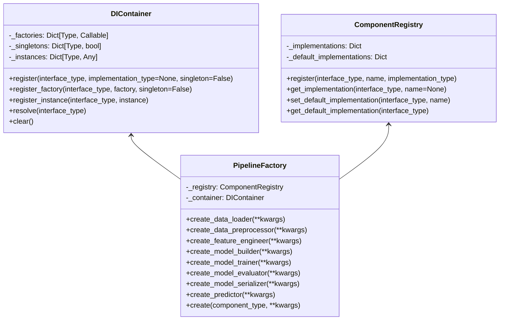

# NexusML Dependency Injection System

## Introduction

The NexusML dependency injection (DI) system provides a way to manage component
dependencies, making the system more testable and maintainable. It follows the
Dependency Inversion Principle from SOLID, allowing high-level modules to depend
on abstractions rather than concrete implementations.

This document explains how the dependency injection system works, how to use it,
and provides examples of registering and resolving dependencies.

## Dependency Injection Architecture

The dependency injection system consists of the following components:

1. **DI Container**: A class that registers and resolves dependencies
2. **Component Registry**: A class that registers component implementations and
   their default implementations
3. **Pipeline Factory**: A class that creates pipeline components with proper
   dependencies

### Dependency Injection Diagram



## DI Container

The `DIContainer` class is responsible for registering and resolving
dependencies. It supports singleton instances, factories, and direct instance
registration.

```python
class DIContainer:
    """
    Dependency Injection Container for managing dependencies.

    The DIContainer is responsible for registering and resolving dependencies,
    supporting singleton instances, factories, and direct instance registration.

    Attributes:
        _factories: Dictionary mapping types to factory functions
        _singletons: Dictionary mapping types to singleton flags
        _instances: Dictionary mapping types to singleton instances
    """

    def __init__(self) -> None:
        """Initialize a new DIContainer with empty registrations."""
        self._factories: Dict[Type[Any], TFactory[Any]] = {}
        self._singletons: Dict[Type[Any], bool] = {}
        self._instances: Dict[Type[Any], Any] = {}

    def register(
        self,
        interface_type: Type[T],
        implementation_type: Optional[Type[T]] = None,
        singleton: bool = False,
    ) -> None:
        """
        Register a type with the container.

        Args:
            interface_type: The type to register (interface or concrete class)
            implementation_type: The implementation type (if different from interface_type)
            singleton: Whether the type should be treated as a singleton

        Note:
            If implementation_type is None, interface_type is used as the implementation.
        """
        if implementation_type is None:
            implementation_type = interface_type

        def factory(container: DIContainer) -> T:
            # Get constructor parameters
            init_params = get_type_hints(implementation_type.__init__).copy()  # type: ignore
            if "return" in init_params:
                del init_params["return"]

            # Resolve dependencies for constructor parameters
            kwargs = {}
            for param_name, param_type in init_params.items():
                if param_name != "self":
                    # Handle Optional types
                    origin = get_origin(param_type)
                    if origin is Union:
                        args = get_args(param_type)
                        # Check if this is Optional[Type] (Union[Type, None])
                        if len(args) == 2 and args[1] is type(None):
                            # This is Optional[Type], try to resolve the inner type
                            try:
                                kwargs[param_name] = container.resolve(args[0])
                            except DependencyNotRegisteredError:
                                # If the inner type is not registered, use None
                                kwargs[param_name] = None
                            continue

                    # Regular type resolution
                    try:
                        kwargs[param_name] = container.resolve(param_type)
                    except DependencyNotRegisteredError:
                        # If the type is not registered and the parameter has a default value,
                        # we'll let the constructor use the default value
                        pass

            # Create instance
            return implementation_type(**kwargs)  # type: ignore

        self._factories[interface_type] = factory
        self._singletons[interface_type] = singleton

    def register_factory(
        self, interface_type: Type[T], factory: TFactory[T], singleton: bool = False
    ) -> None:
        """
        Register a factory function for creating instances.

        Args:
            interface_type: The type to register
            factory: A factory function that creates instances of the type
            singleton: Whether the type should be treated as a singleton
        """
        self._factories[interface_type] = factory
        self._singletons[interface_type] = singleton

    def register_instance(self, interface_type: Type[T], instance: T) -> None:
        """
        Register an existing instance with the container.

        Args:
            interface_type: The type to register
            instance: The instance to register
        """
        self._instances[interface_type] = instance

    def resolve(self, interface_type: Type[T]) -> T:
        """
        Resolve a dependency from the container.

        Args:
            interface_type: The type to resolve

        Returns:
            An instance of the requested type

        Raises:
            DependencyNotRegisteredError: If the type is not registered
        """
        # Handle Optional types
        origin = get_origin(interface_type)
        if origin is Union:
            args = get_args(interface_type)
            # Check if this is Optional[Type] (Union[Type, None])
            if len(args) == 2 and args[1] is type(None):
                # This is Optional[Type], try to resolve the inner type
                try:
                    return self.resolve(args[0])
                except DependencyNotRegisteredError:
                    # If the inner type is not registered, return None
                    return cast(T, None)

        # Check if we have a pre-registered instance
        if interface_type in self._instances:
            return cast(T, self._instances[interface_type])

        # Check if we have a factory for this type
        if interface_type not in self._factories:
            raise DependencyNotRegisteredError(
                f"Type {getattr(interface_type, '__name__', str(interface_type))} is not registered in the container"
            )

        # Get the factory
        factory = self._factories[interface_type]

        # Check if this is a singleton
        if self._singletons.get(interface_type, False):
            if interface_type not in self._instances:
                self._instances[interface_type] = factory(self)
            return cast(T, self._instances[interface_type])

        # Create a new instance
        return factory(self)

    def clear(self) -> None:
        """Clear all registrations from the container."""
        self._factories.clear()
        self._singletons.clear()
        self._instances.clear()
```

## Component Registry

The `ComponentRegistry` class is responsible for registering component
implementations and their default implementations.

```python
class ComponentRegistry:
    """
    Registry for pipeline components.

    The ComponentRegistry is responsible for registering component implementations
    and their default implementations. It provides a way to look up implementations
    by name or get the default implementation for a given interface.
    """

    def __init__(self):
        """Initialize a new ComponentRegistry with empty registrations."""
        self._implementations = {}
        self._default_implementations = {}

    def register(
        self, interface_type: Type[T], name: str, implementation_type: Type[T]
    ) -> None:
        """
        Register an implementation for an interface.

        Args:
            interface_type: The interface type
            name: The name of the implementation
            implementation_type: The implementation type
        """
        if interface_type not in self._implementations:
            self._implementations[interface_type] = {}
        self._implementations[interface_type][name] = implementation_type

    def get_implementation(
        self, interface_type: Type[T], name: Optional[str] = None
    ) -> Type[T]:
        """
        Get an implementation for an interface.

        Args:
            interface_type: The interface type
            name: The name of the implementation (if None, uses the default)

        Returns:
            The implementation type

        Raises:
            ValueError: If the interface or implementation is not registered
        """
        if interface_type not in self._implementations:
            raise ValueError(f"Interface {interface_type.__name__} is not registered")

        if name is None:
            name = self.get_default_implementation_name(interface_type)

        if name not in self._implementations[interface_type]:
            raise ValueError(
                f"Implementation {name} for interface {interface_type.__name__} is not registered"
            )

        return self._implementations[interface_type][name]

    def set_default_implementation(self, interface_type: Type[T], name: str) -> None:
        """
        Set the default implementation for an interface.

        Args:
            interface_type: The interface type
            name: The name of the default implementation

        Raises:
            ValueError: If the interface or implementation is not registered
        """
        if interface_type not in self._implementations:
            raise ValueError(f"Interface {interface_type.__name__} is not registered")

        if name not in self._implementations[interface_type]:
            raise ValueError(
                f"Implementation {name} for interface {interface_type.__name__} is not registered"
            )

        self._default_implementations[interface_type] = name

    def get_default_implementation_name(self, interface_type: Type[T]) -> str:
        """
        Get the name of the default implementation for an interface.

        Args:
            interface_type: The interface type

        Returns:
            The name of the default implementation

        Raises:
            ValueError: If the interface is not registered or has no default
        """
        if interface_type not in self._implementations:
            raise ValueError(f"Interface {interface_type.__name__} is not registered")

        if interface_type not in self._default_implementations:
            raise ValueError(
                f"No default implementation for interface {interface_type.__name__}"
            )

        return self._default_implementations[interface_type]

    def get_default_implementation(self, interface_type: Type[T]) -> Type[T]:
        """
        Get the default implementation for an interface.

        Args:
            interface_type: The interface type

        Returns:
            The default implementation type

        Raises:
            ValueError: If the interface is not registered or has no default
        """
        name = self.get_default_implementation_name(interface_type)
        return self.get_implementation(interface_type, name)
```

## Pipeline Factory

The `PipelineFactory` class is responsible for creating pipeline components with
proper dependencies.

```python
class PipelineFactory:
    """
    Factory for creating pipeline components.

    The PipelineFactory is responsible for creating pipeline components with
    proper dependencies. It uses a component registry to look up implementations
    and a dependency injection container to resolve dependencies.
    """

    def __init__(self, registry: ComponentRegistry, container: DIContainer):
        """
        Initialize a new PipelineFactory.

        Args:
            registry: The component registry to use for looking up implementations
            container: The dependency injection container to use for resolving dependencies
        """
        self._registry = registry
        self._container = container

    def create_data_loader(self, **kwargs) -> DataLoader:
        """
        Create a data loader component.

        Args:
            **kwargs: Additional arguments for the data loader

        Returns:
            A data loader component
        """
        return self.create(DataLoader, **kwargs)

    def create_data_preprocessor(self, **kwargs) -> DataPreprocessor:
        """
        Create a data preprocessor component.

        Args:
            **kwargs: Additional arguments for the data preprocessor

        Returns:
            A data preprocessor component
        """
        return self.create(DataPreprocessor, **kwargs)

    def create_feature_engineer(self, **kwargs) -> FeatureEngineer:
        """
        Create a feature engineer component.

        Args:
            **kwargs: Additional arguments for the feature engineer

        Returns:
            A feature engineer component
        """
        return self.create(FeatureEngineer, **kwargs)

    def create_model_builder(self, **kwargs) -> ModelBuilder:
        """
        Create a model builder component.

        Args:
            **kwargs: Additional arguments for the model builder

        Returns:
            A model builder component
        """
        return self.create(ModelBuilder, **kwargs)

    def create_model_trainer(self, **kwargs) -> ModelTrainer:
        """
        Create a model trainer component.

        Args:
            **kwargs: Additional arguments for the model trainer

        Returns:
            A model trainer component
        """
        return self.create(ModelTrainer, **kwargs)

    def create_model_evaluator(self, **kwargs) -> ModelEvaluator:
        """
        Create a model evaluator component.

        Args:
            **kwargs: Additional arguments for the model evaluator

        Returns:
            A model evaluator component
        """
        return self.create(ModelEvaluator, **kwargs)

    def create_model_serializer(self, **kwargs) -> ModelSerializer:
        """
        Create a model serializer component.

        Args:
            **kwargs: Additional arguments for the model serializer

        Returns:
            A model serializer component
        """
        return self.create(ModelSerializer, **kwargs)

    def create_predictor(self, **kwargs) -> Predictor:
        """
        Create a predictor component.

        Args:
            **kwargs: Additional arguments for the predictor

        Returns:
            A predictor component
        """
        return self.create(Predictor, **kwargs)

    def create(self, component_type: Type[T], **kwargs) -> T:
        """
        Create a component of the specified type.

        Args:
            component_type: The type of component to create
            **kwargs: Additional arguments for the component

        Returns:
            A component of the specified type

        Raises:
            ValueError: If the component type is not registered
        """
        implementation_type = self._registry.get_default_implementation(component_type)

        # Register the implementation with the container
        self._container.register(component_type, implementation_type)

        # Create an instance with the container
        instance = self._container.resolve(component_type)

        # Set additional properties if provided
        for key, value in kwargs.items():
            if hasattr(instance, key):
                setattr(instance, key, value)

        return instance
```

## Using Dependency Injection

### Basic Usage

```python
# Create a registry and container
registry = ComponentRegistry()
container = DIContainer()

# Register components
registry.register(DataLoader, "csv", CSVDataLoader)
registry.register(DataPreprocessor, "standard", StandardPreprocessor)
registry.register(FeatureEngineer, "text", TextFeatureEngineer)
registry.register(ModelBuilder, "random_forest", RandomForestModelBuilder)

# Set default implementations
registry.set_default_implementation(DataLoader, "csv")
registry.set_default_implementation(DataPreprocessor, "standard")
registry.set_default_implementation(FeatureEngineer, "text")
registry.set_default_implementation(ModelBuilder, "random_forest")

# Create a factory
factory = PipelineFactory(registry, container)

# Create components
data_loader = factory.create_data_loader(file_path="data.csv")
preprocessor = factory.create_data_preprocessor()
feature_engineer = factory.create_feature_engineer()
model_builder = factory.create_model_builder(n_estimators=200)
```

### Components with Dependencies

```python
# Define a component with dependencies
class ComponentWithDependencies:
    def __init__(self, data_loader: DataLoader, preprocessor: DataPreprocessor):
        self.data_loader = data_loader
        self.preprocessor = preprocessor

    def process_data(self, data_path: str) -> pd.DataFrame:
        data = self.data_loader.load_data(data_path)
        return self.preprocessor.preprocess(data)

# Register the component
registry.register(ComponentWithDependencies, "default", ComponentWithDependencies)
registry.set_default_implementation(ComponentWithDependencies, "default")

# Create the component - the factory will automatically resolve dependencies
component = factory.create(ComponentWithDependencies)

# Use the component
processed_data = component.process_data("data.csv")
```

### Singleton vs. Transient Instances

```python
# Register a singleton component
container.register(DataLoader, CSVDataLoader, singleton=True)

# Resolve the component multiple times - will return the same instance
data_loader1 = container.resolve(DataLoader)
data_loader2 = container.resolve(DataLoader)
assert data_loader1 is data_loader2  # True

# Register a transient component
container.register(DataPreprocessor, StandardPreprocessor, singleton=False)

# Resolve the component multiple times - will return different instances
preprocessor1 = container.resolve(DataPreprocessor)
preprocessor2 = container.resolve(DataPreprocessor)
assert preprocessor1 is not preprocessor2  # True
```

### Factory Functions

```python
# Define a factory function
def create_data_loader(container: DIContainer) -> DataLoader:
    return CSVDataLoader(file_path="data.csv")

# Register the factory function
container.register_factory(DataLoader, create_data_loader)

# Resolve the component
data_loader = container.resolve(DataLoader)
```

### Direct Instance Registration

```python
# Create an instance
data_loader = CSVDataLoader(file_path="data.csv")

# Register the instance
container.register_instance(DataLoader, data_loader)

# Resolve the component - will return the registered instance
resolved_data_loader = container.resolve(DataLoader)
assert data_loader is resolved_data_loader  # True
```

## Advanced Usage

### Optional Dependencies

```python
# Define a component with optional dependencies
class ComponentWithOptionalDependencies:
    def __init__(self, data_loader: DataLoader, optional_dependency: Optional[DataPreprocessor] = None):
        self.data_loader = data_loader
        self.optional_dependency = optional_dependency

# Register the component
container.register(ComponentWithOptionalDependencies)

# Resolve the component - optional_dependency will be None if not registered
component = container.resolve(ComponentWithOptionalDependencies)
```

### Nested Dependencies

```python
# Define components with nested dependencies
class NestedDependency:
    def __init__(self, data_loader: DataLoader):
        self.data_loader = data_loader

class ComponentWithNestedDependencies:
    def __init__(self, nested_dependency: NestedDependency):
        self.nested_dependency = nested_dependency

# Register the components
container.register(DataLoader, CSVDataLoader)
container.register(NestedDependency)
container.register(ComponentWithNestedDependencies)

# Resolve the component - will automatically resolve nested dependencies
component = container.resolve(ComponentWithNestedDependencies)
```

### Clearing the Container

```python
# Clear all registrations
container.clear()
```

## Best Practices

1. **Use Interfaces**: Define clear interfaces for components and depend on
   those interfaces rather than concrete implementations.

2. **Register Components at Startup**: Register all components at application
   startup to ensure they are available when needed.

3. **Use Singleton for Stateless Components**: Use singleton for components that
   don't maintain state to improve performance.

4. **Use Transient for Stateful Components**: Use transient for components that
   maintain state to avoid unexpected behavior.

5. **Use Factory Functions for Complex Creation Logic**: Use factory functions
   for components that require complex creation logic.

6. **Use Direct Instance Registration for External Dependencies**: Use direct
   instance registration for components that are created outside the container.

7. **Use Optional Dependencies for Optional Features**: Use optional
   dependencies for components that can function without certain dependencies.

8. **Use Nested Dependencies for Complex Dependency Graphs**: Use nested
   dependencies for components that have complex dependency graphs.

9. **Clear the Container for Testing**: Clear the container between tests to
   ensure a clean state.

10. **Use the Factory for Creating Components**: Use the factory for creating
    components rather than resolving them directly from the container.

## Conclusion

The NexusML dependency injection system provides a flexible and maintainable way
to manage component dependencies. By following the Dependency Inversion
Principle from SOLID, it allows high-level modules to depend on abstractions
rather than concrete implementations, making the system more testable and
maintainable.

For more information about specific components, see the API documentation for
the DI container, component registry, and pipeline factory.
