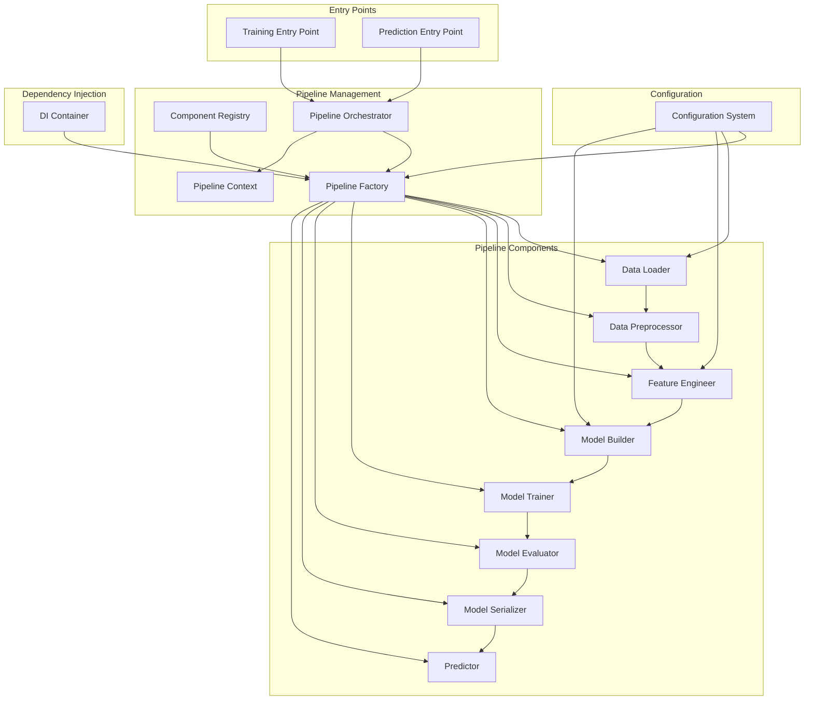
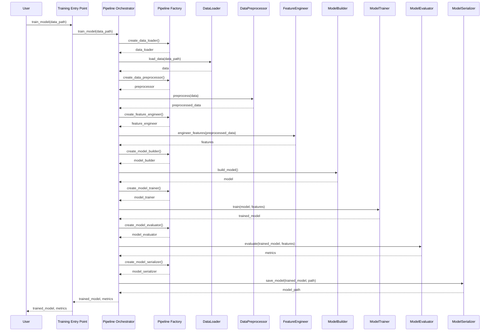

# NexusML Architecture Overview

## Introduction

This document provides an overview of the NexusML architecture, explaining the
key components, their interactions, and the design principles that guided the
refactoring. It serves as a starting point for understanding the system
architecture and navigating the more detailed documentation.

NexusML is a Python machine learning package for equipment classification. It
uses machine learning techniques to categorize equipment into standardized
classification systems like MasterFormat and OmniClass based on textual
descriptions and metadata.

## Architecture Diagram

The following diagram illustrates the high-level architecture of NexusML:



## Key Components

### Configuration System

The configuration system centralizes all settings in a single file, provides
validation through Pydantic models, supports loading from YAML files or
environment variables, and ensures consistent access through a singleton
provider.

Key features:

- Unified configuration in a single file
- Validation through Pydantic models
- Default values for all settings
- Loading from YAML files or environment variables
- Consistent access through a singleton provider

For more details, see [Configuration System](configuration.md).

### Pipeline Components

The pipeline components are responsible for the various stages of the machine
learning pipeline, from data loading to prediction. Each component has a clear
interface and is responsible for a specific part of the pipeline.

Key components:

- **Data Loader**: Loads data from various sources
- **Data Preprocessor**: Cleans and prepares data
- **Feature Engineer**: Transforms raw data into features
- **Model Builder**: Creates and configures models
- **Model Trainer**: Trains models
- **Model Evaluator**: Evaluates models
- **Model Serializer**: Saves and loads models
- **Predictor**: Makes predictions

For more details, see [Pipeline Architecture](pipeline.md).

### Pipeline Management

The pipeline management components are responsible for creating, configuring,
and orchestrating the pipeline components.

Key components:

- **Component Registry**: Registers component implementations and their default
  implementations
- **Pipeline Factory**: Creates pipeline components with proper dependencies
- **Pipeline Orchestrator**: Coordinates the execution of the pipeline
- **Pipeline Context**: Stores state and data during pipeline execution

For more details, see [Pipeline Architecture](pipeline.md).

### Dependency Injection

The dependency injection system provides a way to manage component dependencies,
making the system more testable and maintainable. It follows the Dependency
Inversion Principle from SOLID, allowing high-level modules to depend on
abstractions rather than concrete implementations.

Key components:

- **DI Container**: Registers and resolves dependencies
- **Component Registry**: Registers component implementations
- **Pipeline Factory**: Creates components with dependencies

For more details, see [Dependency Injection](dependency_injection.md).

### Entry Points

The entry points provide a way to use the system for training models and making
predictions. They use the pipeline orchestrator to coordinate the execution of
the pipeline.

Key entry points:

- **Training Entry Point**: Trains a model using the pipeline
- **Prediction Entry Point**: Makes predictions using a trained model

## Design Principles

The refactoring of NexusML was guided by several design principles:

### SOLID Principles

The architecture follows the SOLID principles:

- **Single Responsibility Principle**: Each component has a single
  responsibility
- **Open/Closed Principle**: Components are open for extension but closed for
  modification
- **Liskov Substitution Principle**: Implementations can be substituted for
  their interfaces
- **Interface Segregation Principle**: Interfaces are specific to client needs
- **Dependency Inversion Principle**: High-level modules depend on abstractions

### Dependency Injection

The architecture uses dependency injection to manage component dependencies,
making the system more testable and maintainable. Components depend on
abstractions rather than concrete implementations, and dependencies are injected
through constructors.

### Factory Pattern

The architecture uses the factory pattern to create components with proper
dependencies. The factory uses the component registry to look up implementations
and the dependency injection container to resolve dependencies.

### Adapter Pattern

The architecture uses the adapter pattern to maintain backward compatibility
while introducing new components. Adapters allow old components to be used in
the new architecture and new components to be used in the old architecture.

### Orchestrator Pattern

The architecture uses the orchestrator pattern to coordinate the execution of
the pipeline. The orchestrator uses the factory to create components and the
context to store state and data during execution.

## Folder Structure

The NexusML codebase is organized into the following folders:

```
nexusml/
├── config/                  # Configuration files
├── core/                    # Core components
│   ├── config/              # Configuration system
│   ├── di/                  # Dependency injection system
│   ├── pipeline/            # Pipeline components
│   │   ├── adapters/        # Adapters for backward compatibility
│   │   ├── components/      # Component implementations
│   │   ├── interfaces.py    # Component interfaces
│   │   ├── base.py          # Base implementations
│   │   ├── context.py       # Pipeline context
│   │   ├── factory.py       # Pipeline factory
│   │   ├── orchestrator.py  # Pipeline orchestrator
│   │   └── registry.py      # Component registry
├── data/                    # Data files
├── examples/                # Example scripts
├── scripts/                 # Utility scripts
└── tests/                   # Tests
    ├── integration/         # Integration tests
    └── unit/                # Unit tests
```

## Execution Flow

The following diagram illustrates the execution flow for training a model:



The execution flow for making predictions is similar, but it uses the
`Predictor` component instead of the training components.

## Backward Compatibility

The architecture maintains backward compatibility through several mechanisms:

1. **Adapter Pattern**: Adapters are provided for all components, allowing old
   components to be used in the new architecture and new components to be used
   in the old architecture.

2. **Feature Flags**: Feature flags are used to toggle between old and new code
   paths, allowing you to test the new architecture without affecting existing
   functionality.

3. **Compatibility Layers**: Compatibility layers are provided for all entry
   points, allowing you to use the new architecture with existing code.

4. **Configuration Migration**: Tools are provided for migrating from old
   configuration files to the new unified format.

For more details, see [Migration Overview](../migration/overview.md).

## Conclusion

The NexusML architecture provides a flexible, maintainable, and testable system
for equipment classification. By following a modular design with clear
interfaces, dependency injection, and a factory pattern, it makes it easy to
create, configure, and extend the pipeline.

For more detailed information about specific components, see the following
documentation:

- [Configuration System](configuration.md)
- [Pipeline Architecture](pipeline.md)
- [Dependency Injection](dependency_injection.md)
- [Migration Overview](../migration/overview.md)
