# NexusML Pipeline Architecture

## Introduction

The NexusML pipeline architecture provides a flexible, maintainable, and
testable system for equipment classification. It follows a modular design where
each component is responsible for a specific part of the machine learning
pipeline, from data loading to prediction.

This document explains the pipeline components, their interfaces, the pipeline
factory, the pipeline orchestrator, and how they work together to create a
complete machine learning pipeline.

## Pipeline Architecture Diagram

```mermaid
classDiagram
    class DataLoader {
        <<interface>>
        +load_data(data_path: str) : DataFrame
        +get_config() : Dict
    }

    class DataPreprocessor {
        <<interface>>
        +preprocess(data: DataFrame) : DataFrame
        +verify_required_columns(data: DataFrame) : DataFrame
    }

    class FeatureEngineer {
        <<interface>>
        +engineer_features(data: DataFrame) : DataFrame
        +fit(data: DataFrame) : FeatureEngineer
        +transform(data: DataFrame) : DataFrame
    }

    class ModelBuilder {
        <<interface>>
        +build_model() : Pipeline
        +optimize_hyperparameters(model, x_train, y_train) : Pipeline
    }

    class ModelTrainer {
        <<interface>>
        +train(model, x_train, y_train) : Pipeline
        +cross_validate(model, x, y) : Dict
    }

    class ModelEvaluator {
        <<interface>>
        +evaluate(model, x_test, y_test) : Dict
        +analyze_predictions(model, x_test, y_test, y_pred) : Dict
    }

    class ModelSerializer {
        <<interface>>
        +save_model(model, path) : None
        +load_model(path) : Pipeline
    }

    class Predictor {
        <<interface>>
        +predict(model, data) : DataFrame
        +predict_proba(model, data) : Dict
    }

    class ComponentRegistry {
        -_implementations: Dict
        -_default_implementations: Dict
        +register(interface_type, name, implementation_type)
        +get_implementation(interface_type, name=None)
        +set_default_implementation(interface_type, name)
        +get_default_implementation(interface_type)
    }

    class PipelineFactory {
        -_registry: ComponentRegistry
        -_container: DIContainer
        +create_data_loader(**kwargs) : DataLoader
        +create_data_preprocessor(**kwargs) : DataPreprocessor
        +create_feature_engineer(**kwargs) : FeatureEngineer
        +create_model_builder(**kwargs) : ModelBuilder
        +create_model_trainer(**kwargs) : ModelTrainer
        +create_model_evaluator(**kwargs) : ModelEvaluator
        +create_model_serializer(**kwargs) : ModelSerializer
        +create_predictor(**kwargs) : Predictor
        +create(component_type, **kwargs) : Any
    }

    class PipelineContext {
        -_data: Dict
        -_status: str
        +set(key, value)
        +get(key)
        +get_all()
        +clear()
    }

    class PipelineOrchestrator {
        -_factory: PipelineFactory
        -_context: PipelineContext
        -_execution_times: Dict
        +train_model(data_path, **kwargs) : Tuple[Pipeline, Dict]
        +predict(model, data, **kwargs) : DataFrame
        +evaluate(model, data_path, **kwargs) : Dict
        +save_model(model, path, **kwargs) : str
        +load_model(path, **kwargs) : Pipeline
        +get_execution_summary() : Dict
    }

    ComponentRegistry <-- PipelineFactory
    PipelineFactory <-- PipelineOrchestrator
    PipelineContext <-- PipelineOrchestrator

    PipelineFactory --> DataLoader
    PipelineFactory --> DataPreprocessor
    PipelineFactory --> FeatureEngineer
    PipelineFactory --> ModelBuilder
    PipelineFactory --> ModelTrainer
    PipelineFactory --> ModelEvaluator
    PipelineFactory --> ModelSerializer
    PipelineFactory --> Predictor
```



## Pipeline Components

The NexusML pipeline consists of the following components, each with a specific
responsibility:

### Data Loader

The `DataLoader` interface is responsible for loading data from various sources
and returning it in a standardized format.

```python
class DataLoader(abc.ABC):
    """
    Interface for data loading components.

    Responsible for loading data from various sources and returning it in a standardized format.
    """

    @abc.abstractmethod
    def load_data(self, data_path: Optional[str] = None, **kwargs) -> pd.DataFrame:
        """
        Load data from the specified path.

        Args:
            data_path: Path to the data file. If None, uses a default path.
            **kwargs: Additional arguments for data loading.

        Returns:
            DataFrame containing the loaded data.

        Raises:
            FileNotFoundError: If the data file cannot be found.
            ValueError: If the data format is invalid.
        """
        pass

    @abc.abstractmethod
    def get_config(self) -> Dict[str, Any]:
        """
        Get the configuration for the data loader.

        Returns:
            Dictionary containing the configuration.
        """
        pass
```

### Data Preprocessor

The `DataPreprocessor` interface is responsible for cleaning and preparing data
for feature engineering.

```python
class DataPreprocessor(abc.ABC):
    """
    Interface for data preprocessing components.

    Responsible for cleaning and preparing data for feature engineering.
    """

    @abc.abstractmethod
    def preprocess(self, data: pd.DataFrame, **kwargs) -> pd.DataFrame:
        """
        Preprocess the input data.

        Args:
            data: Input DataFrame to preprocess.
            **kwargs: Additional arguments for preprocessing.

        Returns:
            Preprocessed DataFrame.

        Raises:
            ValueError: If the data cannot be preprocessed.
        """
        pass

    @abc.abstractmethod
    def verify_required_columns(self, data: pd.DataFrame) -> pd.DataFrame:
        """
        Verify that all required columns exist in the DataFrame and create them if they don't.

        Args:
            data: Input DataFrame to verify.

        Returns:
            DataFrame with all required columns.

        Raises:
            ValueError: If required columns cannot be created.
        """
        pass
```

### Feature Engineer

The `FeatureEngineer` interface is responsible for transforming raw data into
features suitable for model training.

```python
class FeatureEngineer(abc.ABC):
    """
    Interface for feature engineering components.

    Responsible for transforming raw data into features suitable for model training.
    """

    @abc.abstractmethod
    def engineer_features(self, data: pd.DataFrame, **kwargs) -> pd.DataFrame:
        """
        Engineer features from the input data.

        Args:
            data: Input DataFrame with raw features.
            **kwargs: Additional arguments for feature engineering.

        Returns:
            DataFrame with engineered features.

        Raises:
            ValueError: If features cannot be engineered.
        """
        pass

    @abc.abstractmethod
    def fit(self, data: pd.DataFrame, **kwargs) -> "FeatureEngineer":
        """
        Fit the feature engineer to the input data.

        Args:
            data: Input DataFrame to fit to.
            **kwargs: Additional arguments for fitting.

        Returns:
            Self for method chaining.

        Raises:
            ValueError: If the feature engineer cannot be fit to the data.
        """
        pass

    @abc.abstractmethod
    def transform(self, data: pd.DataFrame, **kwargs) -> pd.DataFrame:
        """
        Transform the input data using the fitted feature engineer.

        Args:
            data: Input DataFrame to transform.
            **kwargs: Additional arguments for transformation.

        Returns:
            Transformed DataFrame.

        Raises:
            ValueError: If the data cannot be transformed.
        """
        pass
```

### Model Builder

The `ModelBuilder` interface is responsible for creating and configuring machine
learning models.

```python
class ModelBuilder(abc.ABC):
    """
    Interface for model building components.

    Responsible for creating and configuring machine learning models.
    """

    @abc.abstractmethod
    def build_model(self, **kwargs) -> Pipeline:
        """
        Build a machine learning model.

        Args:
            **kwargs: Configuration parameters for the model.

        Returns:
            Configured model pipeline.

        Raises:
            ValueError: If the model cannot be built with the given parameters.
        """
        pass

    @abc.abstractmethod
    def optimize_hyperparameters(
        self, model: Pipeline, x_train: pd.DataFrame, y_train: pd.DataFrame, **kwargs
    ) -> Pipeline:
        """
        Optimize hyperparameters for the model.

        Args:
            model: Model pipeline to optimize.
            x_train: Training features.
            y_train: Training targets.
            **kwargs: Additional arguments for hyperparameter optimization.

        Returns:
            Optimized model pipeline.

        Raises:
            ValueError: If hyperparameters cannot be optimized.
        """
        pass
```

### Model Trainer

The `ModelTrainer` interface is responsible for training machine learning models
on prepared data.

```python
class ModelTrainer(abc.ABC):
    """
    Interface for model training components.

    Responsible for training machine learning models on prepared data.
    """

    @abc.abstractmethod
    def train(
        self, model: Pipeline, x_train: pd.DataFrame, y_train: pd.DataFrame, **kwargs
    ) -> Pipeline:
        """
        Train a model on the provided data.

        Args:
            model: Model pipeline to train.
            x_train: Training features.
            y_train: Training targets.
            **kwargs: Additional arguments for training.

        Returns:
            Trained model pipeline.

        Raises:
            ValueError: If the model cannot be trained.
        """
        pass

    @abc.abstractmethod
    def cross_validate(
        self, model: Pipeline, x: pd.DataFrame, y: pd.DataFrame, **kwargs
    ) -> Dict[str, List[float]]:
        """
        Perform cross-validation on the model.

        Args:
            model: Model pipeline to validate.
            x: Feature data.
            y: Target data.
            **kwargs: Additional arguments for cross-validation.

        Returns:
            Dictionary of validation metrics.

        Raises:
            ValueError: If cross-validation cannot be performed.
        """
        pass
```

### Model Evaluator

The `ModelEvaluator` interface is responsible for evaluating trained models and
analyzing their performance.

```python
class ModelEvaluator(abc.ABC):
    """
    Interface for model evaluation components.

    Responsible for evaluating trained models and analyzing their performance.
    """

    @abc.abstractmethod
    def evaluate(
        self, model: Pipeline, x_test: pd.DataFrame, y_test: pd.DataFrame, **kwargs
    ) -> Dict[str, Any]:
        """
        Evaluate a trained model on test data.

        Args:
            model: Trained model pipeline to evaluate.
            x_test: Test features.
            y_test: Test targets.
            **kwargs: Additional arguments for evaluation.

        Returns:
            Dictionary of evaluation metrics.

        Raises:
            ValueError: If the model cannot be evaluated.
        """
        pass

    @abc.abstractmethod
    def analyze_predictions(
        self,
        model: Pipeline,
        x_test: pd.DataFrame,
        y_test: pd.DataFrame,
        y_pred: pd.DataFrame,
        **kwargs,
    ) -> Dict[str, Any]:
        """
        Analyze model predictions in detail.

        Args:
            model: Trained model pipeline.
            x_test: Test features.
            y_test: Test targets.
            y_pred: Model predictions.
            **kwargs: Additional arguments for analysis.

        Returns:
            Dictionary of analysis results.

        Raises:
            ValueError: If predictions cannot be analyzed.
        """
        pass
```

### Model Serializer

The `ModelSerializer` interface is responsible for saving and loading trained
models.

```python
class ModelSerializer(abc.ABC):
    """
    Interface for model serialization components.

    Responsible for saving and loading trained models.
    """

    @abc.abstractmethod
    def save_model(self, model: Pipeline, path: Union[str, Path], **kwargs) -> None:
        """
        Save a trained model to disk.

        Args:
            model: Trained model pipeline to save.
            path: Path where the model should be saved.
            **kwargs: Additional arguments for saving.

        Raises:
            IOError: If the model cannot be saved.
        """
        pass

    @abc.abstractmethod
    def load_model(self, path: Union[str, Path], **kwargs) -> Pipeline:
        """
        Load a trained model from disk.

        Args:
            path: Path to the saved model.
            **kwargs: Additional arguments for loading.

        Returns:
            Loaded model pipeline.

        Raises:
            IOError: If the model cannot be loaded.
            ValueError: If the loaded file is not a valid model.
        """
        pass
```

### Predictor

The `Predictor` interface is responsible for making predictions using trained
models.

```python
class Predictor(abc.ABC):
    """
    Interface for prediction components.

    Responsible for making predictions using trained models.
    """

    @abc.abstractmethod
    def predict(self, model: Pipeline, data: pd.DataFrame, **kwargs) -> pd.DataFrame:
        """
        Make predictions using a trained model.

        Args:
            model: Trained model pipeline.
            data: Input data for prediction.
            **kwargs: Additional arguments for prediction.

        Returns:
            DataFrame containing predictions.

        Raises:
            ValueError: If predictions cannot be made.
        """
        pass

    @abc.abstractmethod
    def predict_proba(
        self, model: Pipeline, data: pd.DataFrame, **kwargs
    ) -> Dict[str, pd.DataFrame]:
        """
        Make probability predictions using a trained model.

        Args:
            model: Trained model pipeline.
            data: Input data for prediction.
            **kwargs: Additional arguments for prediction.

        Returns:
            Dictionary mapping target columns to DataFrames of class probabilities.

        Raises:
            ValueError: If probability predictions cannot be made.
        """
        pass
```

## Component Registry

The `ComponentRegistry` class is responsible for registering component
implementations and their default implementations.

```python
class ComponentRegistry:
    """
    Registry for pipeline components.

    The ComponentRegistry is responsible for registering component implementations
    and their default implementations. It provides a way to look up implementations
    by name or get the default implementation for a given interface.
    """

    def __init__(self):
        """Initialize a new ComponentRegistry with empty registrations."""
        self._implementations = {}
        self._default_implementations = {}

    def register(
        self, interface_type: Type[T], name: str, implementation_type: Type[T]
    ) -> None:
        """
        Register an implementation for an interface.

        Args:
            interface_type: The interface type
            name: The name of the implementation
            implementation_type: The implementation type
        """
        if interface_type not in self._implementations:
            self._implementations[interface_type] = {}
        self._implementations[interface_type][name] = implementation_type

    def get_implementation(
        self, interface_type: Type[T], name: Optional[str] = None
    ) -> Type[T]:
        """
        Get an implementation for an interface.

        Args:
            interface_type: The interface type
            name: The name of the implementation (if None, uses the default)

        Returns:
            The implementation type

        Raises:
            ValueError: If the interface or implementation is not registered
        """
        if interface_type not in self._implementations:
            raise ValueError(f"Interface {interface_type.__name__} is not registered")

        if name is None:
            name = self.get_default_implementation_name(interface_type)

        if name not in self._implementations[interface_type]:
            raise ValueError(
                f"Implementation {name} for interface {interface_type.__name__} is not registered"
            )

        return self._implementations[interface_type][name]

    def set_default_implementation(self, interface_type: Type[T], name: str) -> None:
        """
        Set the default implementation for an interface.

        Args:
            interface_type: The interface type
            name: The name of the default implementation

        Raises:
            ValueError: If the interface or implementation is not registered
        """
        if interface_type not in self._implementations:
            raise ValueError(f"Interface {interface_type.__name__} is not registered")

        if name not in self._implementations[interface_type]:
            raise ValueError(
                f"Implementation {name} for interface {interface_type.__name__} is not registered"
            )

        self._default_implementations[interface_type] = name

    def get_default_implementation_name(self, interface_type: Type[T]) -> str:
        """
        Get the name of the default implementation for an interface.

        Args:
            interface_type: The interface type

        Returns:
            The name of the default implementation

        Raises:
            ValueError: If the interface is not registered or has no default
        """
        if interface_type not in self._implementations:
            raise ValueError(f"Interface {interface_type.__name__} is not registered")

        if interface_type not in self._default_implementations:
            raise ValueError(
                f"No default implementation for interface {interface_type.__name__}"
            )

        return self._default_implementations[interface_type]

    def get_default_implementation(self, interface_type: Type[T]) -> Type[T]:
        """
        Get the default implementation for an interface.

        Args:
            interface_type: The interface type

        Returns:
            The default implementation type

        Raises:
            ValueError: If the interface is not registered or has no default
        """
        name = self.get_default_implementation_name(interface_type)
        return self.get_implementation(interface_type, name)
```

## Pipeline Factory

The `PipelineFactory` class is responsible for creating pipeline components with
proper dependencies.

```python
class PipelineFactory:
    """
    Factory for creating pipeline components.

    The PipelineFactory is responsible for creating pipeline components with
    proper dependencies. It uses a component registry to look up implementations
    and a dependency injection container to resolve dependencies.
    """

    def __init__(self, registry: ComponentRegistry, container: DIContainer):
        """
        Initialize a new PipelineFactory.

        Args:
            registry: The component registry to use for looking up implementations
            container: The dependency injection container to use for resolving dependencies
        """
        self._registry = registry
        self._container = container

    def create_data_loader(self, **kwargs) -> DataLoader:
        """
        Create a data loader component.

        Args:
            **kwargs: Additional arguments for the data loader

        Returns:
            A data loader component
        """
        return self.create(DataLoader, **kwargs)

    def create_data_preprocessor(self, **kwargs) -> DataPreprocessor:
        """
        Create a data preprocessor component.

        Args:
            **kwargs: Additional arguments for the data preprocessor

        Returns:
            A data preprocessor component
        """
        return self.create(DataPreprocessor, **kwargs)

    def create_feature_engineer(self, **kwargs) -> FeatureEngineer:
        """
        Create a feature engineer component.

        Args:
            **kwargs: Additional arguments for the feature engineer

        Returns:
            A feature engineer component
        """
        return self.create(FeatureEngineer, **kwargs)

    def create_model_builder(self, **kwargs) -> ModelBuilder:
        """
        Create a model builder component.

        Args:
            **kwargs: Additional arguments for the model builder

        Returns:
            A model builder component
        """
        return self.create(ModelBuilder, **kwargs)

    def create_model_trainer(self, **kwargs) -> ModelTrainer:
        """
        Create a model trainer component.

        Args:
            **kwargs: Additional arguments for the model trainer

        Returns:
            A model trainer component
        """
        return self.create(ModelTrainer, **kwargs)

    def create_model_evaluator(self, **kwargs) -> ModelEvaluator:
        """
        Create a model evaluator component.

        Args:
            **kwargs: Additional arguments for the model evaluator

        Returns:
            A model evaluator component
        """
        return self.create(ModelEvaluator, **kwargs)

    def create_model_serializer(self, **kwargs) -> ModelSerializer:
        """
        Create a model serializer component.

        Args:
            **kwargs: Additional arguments for the model serializer

        Returns:
            A model serializer component
        """
        return self.create(ModelSerializer, **kwargs)

    def create_predictor(self, **kwargs) -> Predictor:
        """
        Create a predictor component.

        Args:
            **kwargs: Additional arguments for the predictor

        Returns:
            A predictor component
        """
        return self.create(Predictor, **kwargs)

    def create(self, component_type: Type[T], **kwargs) -> T:
        """
        Create a component of the specified type.

        Args:
            component_type: The type of component to create
            **kwargs: Additional arguments for the component

        Returns:
            A component of the specified type

        Raises:
            ValueError: If the component type is not registered
        """
        implementation_type = self._registry.get_default_implementation(component_type)

        # Register the implementation with the container
        self._container.register(component_type, implementation_type)

        # Create an instance with the container
        instance = self._container.resolve(component_type)

        # Set additional properties if provided
        for key, value in kwargs.items():
            if hasattr(instance, key):
                setattr(instance, key, value)

        return instance
```

## Pipeline Context

The `PipelineContext` class is responsible for storing state and data during
pipeline execution.

```python
class PipelineContext:
    """
    Context for pipeline execution.

    The PipelineContext is responsible for storing state and data during
    pipeline execution. It provides a way to pass data between pipeline
    components and track the status of the pipeline.
    """

    def __init__(self):
        """Initialize a new PipelineContext with empty data and 'initialized' status."""
        self._data = {}
        self._status = "initialized"

    @property
    def status(self) -> str:
        """
        Get the current status of the pipeline.

        Returns:
            The current status
        """
        return self._status

    @status.setter
    def status(self, value: str) -> None:
        """
        Set the current status of the pipeline.

        Args:
            value: The new status
        """
        self._status = value

    def set(self, key: str, value: Any) -> None:
        """
        Set a value in the context.

        Args:
            key: The key to set
            value: The value to set
        """
        self._data[key] = value

    def get(self, key: str, default: Any = None) -> Any:
        """
        Get a value from the context.

        Args:
            key: The key to get
            default: The default value to return if the key is not found

        Returns:
            The value for the key, or the default if the key is not found
        """
        return self._data.get(key, default)

    def get_all(self) -> Dict[str, Any]:
        """
        Get all data from the context.

        Returns:
            A dictionary containing all data in the context
        """
        return self._data.copy()

    def clear(self) -> None:
        """Clear all data from the context and reset the status."""
        self._data.clear()
        self._status = "initialized"
```

## Pipeline Orchestrator

The `PipelineOrchestrator` class is responsible for coordinating the execution
of the pipeline.

```python
class PipelineOrchestrator:
    """
    Orchestrator for pipeline execution.

    The PipelineOrchestrator is responsible for coordinating the execution of
    the pipeline. It uses a pipeline factory to create components and a
    pipeline context to store state and data during execution.
    """

    def __init__(self, factory: PipelineFactory, context: PipelineContext):
        """
        Initialize a new PipelineOrchestrator.

        Args:
            factory: The pipeline factory to use for creating components
            context: The pipeline context to use for storing state and data
        """
        self._factory = factory
        self._context = context
        self._execution_times = {}

    @property
    def context(self) -> PipelineContext:
        """
        Get the pipeline context.

        Returns:
            The pipeline context
        """
        return self._context

    def train_model(
        self,
        data_path: str,
        feature_config_path: Optional[str] = None,
        test_size: float = 0.3,
        random_state: int = 42,
        sampling_strategy: str = "direct",
        optimize_hyperparameters: bool = False,
        output_dir: str = "outputs/models",
        model_name: str = "equipment_classifier",
        **kwargs,
    ) -> Tuple[Pipeline, Dict[str, Any]]:
        """
        Train a model using the pipeline.

        Args:
            data_path: Path to the data file
            feature_config_path: Path to the feature configuration file
            test_size: Proportion of data to use for testing
            random_state: Random state for reproducibility
            sampling_strategy: Sampling strategy for handling class imbalance
            optimize_hyperparameters: Whether to optimize hyperparameters
            output_dir: Directory to save the trained model and results
            model_name: Base name for the saved model
            **kwargs: Additional arguments for pipeline components

        Returns:
            A tuple containing the trained model and evaluation metrics

        Raises:
            ValueError: If the model cannot be trained
        """
        try:
            # Set up context
            self._context.clear()
            self._context.status = "training"
            self._context.set("data_path", data_path)
            self._context.set("feature_config_path", feature_config_path)
            self._context.set("test_size", test_size)
            self._context.set("random_state", random_state)
            self._context.set("sampling_strategy", sampling_strategy)
            self._context.set("optimize_hyperparameters", optimize_hyperparameters)
            self._context.set("output_dir", output_dir)
            self._context.set("model_name", model_name)

            # Create components
            data_loader = self._factory.create_data_loader(**kwargs.get("data_loader", {}))
            preprocessor = self._factory.create_data_preprocessor(**kwargs.get("preprocessor", {}))
            feature_engineer = self._factory.create_feature_engineer(**kwargs.get("feature_engineer", {}))
            model_builder = self._factory.create_model_builder(**kwargs.get("model_builder", {}))
            model_trainer = self._factory.create_model_trainer(**kwargs.get("model_trainer", {}))
            model_evaluator = self._factory.create_model_evaluator(**kwargs.get("model_evaluator", {}))
            model_serializer = self._factory.create_model_serializer(**kwargs.get("model_serializer", {}))

            # Load and preprocess data
            start_time = time.time()
            data = data_loader.load_data(data_path)
            self._execution_times["data_loading"] = time.time() - start_time

            start_time = time.time()
            preprocessed_data = preprocessor.preprocess(data)
            self._execution_times["preprocessing"] = time.time() - start_time

            # Engineer features
            start_time = time.time()
            features = feature_engineer.engineer_features(preprocessed_data)
            self._execution_times["feature_engineering"] = time.time() - start_time

            # Split data
            X = features.drop(kwargs.get("target_columns", ["target"]), axis=1)
            y = features[kwargs.get("target_columns", ["target"])]
            X_train, X_test, y_train, y_test = train_test_split(
                X, y, test_size=test_size, random_state=random_state
            )

            # Build and train model
            start_time = time.time()
            model = model_builder.build_model()
            self._execution_times["model_building"] = time.time() - start_time

            if optimize_hyperparameters:
                start_time = time.time()
                model = model_builder.optimize_hyperparameters(model, X_train, y_train)
                self._execution_times["hyperparameter_optimization"] = time.time() - start_time

            start_time = time.time()
            trained_model = model_trainer.train(model, X_train, y_train)
            self._execution_times["model_training"] = time.time() - start_time

            # Evaluate model
            start_time = time.time()
            metrics = model_evaluator.evaluate(trained_model, X_test, y_test)
            self._execution_times["model_evaluation"] = time.time() - start_time

            # Save model
            start_time = time.time()
            os.makedirs(output_dir, exist_ok=True)
            model_path = os.path.join(output_dir, f"{model_name}.pkl")
            metadata_path = os.path.join(output_dir, f"{model_name}_metadata.json")
            model_serializer.save_model(trained_model, model_path)
            self._execution_times["model_serialization"] = time.time() - start_time

            # Save metadata
            metadata = {
                "model_name": model_name,
                "data_path": data_path,
                "feature_config_path": feature_config_path,
                "test_size": test_size,
                "random_state": random_state,
                "sampling_strategy": sampling_strategy,
                "optimize_hyperparameters": optimize_hyperparameters,
                "metrics": metrics,
                "created_at": datetime.datetime.now().isoformat(),
            }
            with open(metadata_path, "w") as f:
                json.dump(metadata, f, indent=2)

            # Update context
            self._context.set("model", trained_model)
            self._context.set("model_path", model_path)
            self._context.set("metadata_path", metadata_path)
            self._context.set("metrics", metrics)
            self._context.status = "completed"

            return trained_model, metrics

        except Exception as e:
            self._context.status = "error"
            self._context.set("error", str(e))
            raise

    def predict(
        self,
        model: Optional[Pipeline] = None,
        data: Optional[pd.DataFrame] = None,
        data_path: Optional[str] = None,
        output_path: Optional[str] = "outputs/predictions.csv",
        **kwargs,
    ) -> pd.DataFrame:
        """
        Make predictions using a trained model.

        Args:
            model: Trained model pipeline (if None, uses the model from the context)
            data: Input data for prediction (if None, loads data from data_path)
            data_path: Path to the data file (if None and data is None, raises ValueError)
            output_path: Path to save the predictions (if None, doesn't save)
            **kwargs: Additional arguments for pipeline components

        Returns:
            DataFrame containing predictions

        Raises:
            ValueError: If neither model nor data is provided
        """
        try:
            # Set up context
            self._context.status = "predicting"
            if model is not None:
                self._context.set("model", model)
            if data_path is not None:
                self._context.set("data_path", data_path)
            if output_path is not None:
                self._context.set("output_path", output_path)

            # Get model from context if not provided
            if model is None:
                model = self._context.get("model")
                if model is None:
                    raise ValueError("No model provided and no model in context")

            # Create components
            data_loader = self._factory.create_data_loader(**kwargs.get("data_loader", {}))
            preprocessor = self._factory.create_data_preprocessor(**kwargs.get("preprocessor", {}))
            feature_engineer = self._factory.create_feature_engineer(**kwargs.get("feature_engineer", {}))
            predictor = self._factory.create_predictor(**kwargs.get("predictor", {}))

            # Load and preprocess data if not provided
            if data is None:
                if data_path is None:
                    data_path = self._context.get("data_path")
                    if data_path is None:
                        raise ValueError("No data or data_path provided")

                start_time = time.time()
                data = data_loader.load_data(data_path)
                self._execution_times["data_loading"] = time.time() - start_time

                start_time = time.time()
                data = preprocessor.preprocess(data)
                self._execution_times["preprocessing"] = time.time() - start_time

                start_time = time.time()
                data = feature_engineer.engineer_features(data)
                self._execution_times["feature_engineering"] = time.time() - start_time

            # Make predictions
            start_time = time.time()
            predictions = predictor.predict(model, data)
            self._execution_times["prediction"] = time.time() - start_time

            # Save predictions if output_path is provided
            if output_path is not None:
                os.makedirs(os.path.dirname(output_path), exist_ok=True)
                predictions.to_csv(output_path, index=False)

            # Update context
            self._context.set("predictions", predictions)
            self._context.status = "completed"

            return predictions

        except Exception as e:
            self._context.status = "error"
            self._context.set("error", str(e))
            raise

    def evaluate(
        self,
        model: Optional[Pipeline] = None,
        data_path: Optional[str] = None,
        output_path: Optional[str] = "outputs/evaluation_results.json",
        **kwargs,
    ) -> Dict[str, Any]:
        """
        Evaluate a model on test data.

        Args:
            model: Trained model pipeline (if None, uses the model from the context)
            data_path: Path to the data file (if None, uses the data_path from the context)
            output_path: Path to save the evaluation results (if None, doesn't save)
            **kwargs: Additional arguments for pipeline components

        Returns:
            Dictionary of evaluation results

        Raises:
            ValueError: If neither model nor data_path is provided
        """
        try:
            # Set up context
            self._context.status = "evaluating"
            if model is not None:
                self._context.set("model", model)
            if data_path is not None:
                self._context.set("data_path", data_path)
            if output_path is not None:
                self._context.set("output_path", output_path)

            # Get model from context if not provided
            if model is None:
                model = self._context.get("model")
                if model is None:
                    raise ValueError("No model provided and no model in context")

            # Get data_path from context if not provided
            if data_path is None:
                data_path = self._context.get("data_path")
                if data_path is None:
                    raise ValueError("No data_path provided and no data_path in context")

            # Create components
            data_loader = self._factory.create_data_loader(**kwargs.get("data_loader", {}))
            preprocessor = self._factory.create_data_preprocessor(**kwargs.get("preprocessor", {}))
            feature_engineer = self._factory.create_feature_engineer(**kwargs.get("feature_engineer", {}))
            model_evaluator = self._factory.create_model_evaluator(**kwargs.get("model_evaluator", {}))
            predictor = self._factory.create_predictor(**kwargs.get("predictor", {}))

            # Load and preprocess data
            start_time = time.time()
            data = data_loader.load_data(data_path)
            self._execution_times["data_loading"] = time.time() - start_time

            start_time = time.time()
            data = preprocessor.preprocess(data)
            self._execution_times["preprocessing"] = time.time() - start_time

            start_time = time.time()
            data = feature_engineer.engineer_features(data)
            self._execution_times["feature_engineering"] = time.time() - start_time

            # Split data
            X = data.drop(kwargs.get("target_columns", ["target"]), axis=1)
            y = data[kwargs.get("target_columns", ["target"])]

            # Make predictions
            start_time = time.time()
            y_pred = predictor.predict(model, X)
            self._execution_times["prediction"] = time.time() - start_time

            # Evaluate model
            start_time = time.time()
            metrics = model_evaluator.evaluate(model, X, y)
            analysis = model_evaluator.analyze_predictions(model, X, y, y_pred)
            self._execution_times["evaluation"] = time.time() - start_time

            # Combine results
            results = {
                "metrics": metrics,
                "analysis": analysis,
            }

            # Save results if output_path is provided
            if output_path is not None:
                os.makedirs(os.path.dirname(output_path), exist_ok=True)
                with open(output_path, "w") as f:
                    json.dump(results, f, indent=2)

            # Update context
            self._context.set("evaluation_results", results)
            self._context.status = "completed"

            return results

        except Exception as e:
            self._context.status = "error"
            self._context.set("error", str(e))
            raise

    def save_model(
        self,
        model: Optional[Pipeline] = None,
        path: Optional[str] = None,
        **kwargs,
    ) -> str:
        """
        Save a model to disk.

        Args:
            model: Trained model pipeline (if None, uses the model from the context)
            path: Path to save the model (if None, uses a default path)
            **kwargs: Additional arguments for the model serializer

        Returns:
            Path where the model was saved

        Raises:
            ValueError: If neither model nor path is provided
        """
        try:
            # Set up context
            self._context.status = "saving_model"
            if model is not None:
                self._context.set("model", model)
            if path is not None:
                self._context.set("model_path", path)

            # Get model from context if not provided
            if model is None:
                model = self._context.get("model")
                if model is None:
                    raise ValueError("No model provided and no model in context")

            # Get path from context if not provided
            if path is None:
                path = self._context.get("model_path")
                if path is None:
                    # Use default path
                    output_dir = self._context.get("output_dir", "outputs/models")
                    model_name = self._context.get("model_name", "equipment_classifier")
                    path = os.path.join(output_dir, f"{model_name}.pkl")

            # Create model serializer
            model_serializer = self._factory.create_model_serializer(**kwargs)

            # Save model
            start_time = time.time()
            os.makedirs(os.path.dirname(path), exist_ok=True)
            model_serializer.save_model(model, path)
            self._execution_times["model_serialization"] = time.time() - start_time

            # Update context
            self._context.set("model_path", path)
            self._context.status = "completed"

            return path

        except Exception as e:
            self._context.status = "error"
            self._context.set("error", str(e))
            raise

    def load_model(
        self,
        path: Optional[str] = None,
        **kwargs,
    ) -> Pipeline:
        """
        Load a model from disk.

        Args:
            path: Path to the saved model (if None, uses the model_path from the context)
            **kwargs: Additional arguments for the model serializer

        Returns:
            Loaded model pipeline

        Raises:
            ValueError: If path is not provided and not in context
        """
        try:
            # Set up context
            self._context.status = "loading_model"
            if path is not None:
                self._context.set("model_path", path)

            # Get path from context if not provided
            if path is None:
                path = self._context.get("model_path")
                if path is None:
                    raise ValueError("No path provided and no model_path in context")

            # Create model serializer
            model_serializer = self._factory.create_model_serializer(**kwargs)

            # Load model
            start_time = time.time()
            model = model_serializer.load_model(path)
            self._execution_times["model_loading"] = time.time() - start_time

            # Update context
            self._context.set("model", model)
            self._context.status = "completed"

            return model

        except Exception as e:
            self._context.status = "error"
            self._context.set("error", str(e))
            raise

    def get_execution_summary(self) -> Dict[str, Any]:
        """
        Get a summary of the pipeline execution.

        Returns:
            Dictionary containing execution summary
        """
        return {
            "status": self._context.status,
            "component_execution_times": self._execution_times,
            "total_execution_time": sum(self._execution_times.values()),
        }
```

## Creating Custom Components

To create custom components, you need to implement the appropriate interface and
register it with the component registry.

### Example: Custom Data Loader

```python
class CustomDataLoader(DataLoader):
    """Custom data loader implementation."""

    def __init__(self, file_path=None):
        """
        Initialize a new CustomDataLoader.

        Args:
            file_path: Path to the data file
        """
        self.file_path = file_path

    def load_data(self, data_path=None, **kwargs):
        """
        Load data from the specified path.

        Args:
            data_path: Path to the data file (if None, uses self.file_path)
            **kwargs: Additional arguments for data loading

        Returns:
            DataFrame containing the loaded data

        Raises:
            FileNotFoundError: If the data file cannot be found
            ValueError: If the data format is invalid
        """
        path = data_path or self.file_path
        if path is None:
            raise ValueError("No data path provided")

        try:
            # Custom data loading logic
            return pd.read_csv(path, **kwargs)
        except FileNotFoundError:
            raise FileNotFoundError(f"Data file not found: {path}")
        except Exception as e:
            raise ValueError(f"Error loading data: {str(e)}")

    def get_config(self):
        """
        Get the configuration for the data loader.

        Returns:
            Dictionary containing the configuration
        """
        return {"file_path": self.file_path}
```

### Registering Custom Components

```python
# Create a registry and container
registry = ComponentRegistry()
container = DIContainer()

# Register custom components
registry.register(DataLoader, "custom", CustomDataLoader)
registry.set_default_implementation(DataLoader, "custom")

# Create a factory
factory = PipelineFactory(registry, container)

# Create components
data_loader = factory.create_data_loader(file_path="data.csv")
```

## Conclusion

The NexusML pipeline architecture provides a flexible, maintainable, and
testable system for equipment classification. By following a modular design with
clear interfaces, dependency injection, and a factory pattern, it makes it easy
to create, configure, and extend the pipeline.

For more information about specific components, see the API documentation for
the interfaces and implementations.
