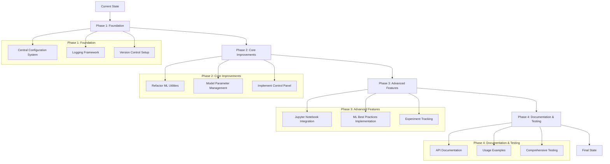

Now that I've gathered sufficient information about the codebase, let me create
a comprehensive roadmap document for the NexusML project. This roadmap will
outline the steps needed to implement the improvements you've requested.

# NexusML Project Roadmap

## Overview

This roadmap outlines the steps needed to enhance the NexusML package with
improved organization, configuration, logging, documentation, and best
practices. The goal is to create a more maintainable, robust, and user-friendly
machine learning package.



## Phase 1: Foundation

### 1.1 Central Configuration System

**Objective**: Create a unified configuration system that allows for easy
customization of model parameters, data paths, and other settings.

**Tasks**:

- Create a dedicated `config` module in the NexusML package
- Implement a hierarchical configuration system with defaults and overrides
- Support multiple configuration formats (YAML, JSON, Python)
- Implement environment variable support for sensitive information
- Create validation for configuration parameters

**Implementation Details**:

```python
# Example structure for config module
nexusml/
  config/
    __init__.py
    defaults.py
    schema.py
    loader.py
```

**Migration Plan**:

1. Extract configuration logic from existing files (model_building.py,
   data_preprocessing.py)
2. Centralize in the new config module
3. Update all references to use the new configuration system

### 1.2 Logging Framework

**Objective**: Implement a comprehensive logging system that provides
consistent, configurable logging across the entire package.

**Tasks**:

- Migrate the logging_config.py from fca_dashboard to nexusml/utils
- Adapt the logging configuration for NexusML-specific needs
- Implement log rotation and retention policies
- Add context-specific logging (model training, evaluation, etc.)
- Create log formatters for different environments (development, production)

**Implementation Details**:

```python
# Example usage of logging system
from nexusml.utils.logging import get_logger

logger = get_logger(__name__)
logger.info("Training model with parameters: %s", params)
```

### 1.3 Version Control Setup

**Objective**: Establish proper version control practices for the NexusML
package.

**Tasks**:

- Create a .gitignore file with appropriate patterns for Python/ML projects
- Set up Git LFS for large files (models, datasets)
- Implement semantic versioning in **init**.py
- Create a CHANGELOG.md file to track changes
- Set up branch protection rules if using GitHub

## Phase 2: Core Improvements

### 2.1 Refactor ML Utilities

**Objective**: Refactor and migrate ML utility functions from fca_dashboard to
nexusml/utils.

**Tasks**:

- Identify ML-specific utility functions in fca_dashboard
- Migrate the following utilities:
  - Data cleaning utilities (from data_cleaning_utils.py)
  - Path utilities (from path_util.py)
  - Verification utilities (already partially migrated)
  - Model serialization utilities
- Organize utilities into logical modules:
  - nexusml/utils/data_utils.py
  - nexusml/utils/model_utils.py
  - nexusml/utils/path_utils.py
  - nexusml/utils/validation_utils.py

**Candidate Functions for Migration**:

- `find_header_row` and `clean_dataframe` from data_cleaning_utils.py
- `resolve_path` and `get_config_path` from path_util.py
- Functions for model serialization and loading

### 2.2 Model Parameter Management

**Objective**: Implement a system for saving, loading, and tracking model
parameters and outputs.

**Tasks**:

- Create a model registry for tracking trained models
- Implement serialization/deserialization for models and parameters
- Add metadata tracking for models (training date, dataset, performance metrics)
- Implement versioning for models
- Create utilities for comparing model versions

**Implementation Details**:

```python
# Example model registry usage
from nexusml.utils.model_registry import ModelRegistry

registry = ModelRegistry("models/")
model_id = registry.save_model(model, metadata={"dataset": "eq_ids.csv", "accuracy": 0.92})
model = registry.load_model(model_id)
```

### 2.3 Implement Control Panel

**Objective**: Create an HTML-based control panel for visualizing model
statistics, weights, parameters, and other relevant information.

**Tasks**:

- Design the control panel UI
- Implement backend API for retrieving model information
- Create visualizations for model performance metrics
- Add parameter inspection capabilities
- Implement feature importance visualization
- Add dataset statistics visualization

**Implementation Details**:

```
nexusml/
  control_panel/
    __init__.py
    app.py          # Flask/FastAPI application
    templates/      # HTML templates
    static/         # CSS, JS, and other static files
    api/            # API endpoints
```

**Technologies**:

- Backend: Flask or FastAPI
- Frontend: HTML, CSS, JavaScript (possibly with Vue.js or React)
- Visualization: Plotly, D3.js, or similar

## Phase 3: Advanced Features

### 3.1 Jupyter Notebook Integration

**Objective**: Enhance NexusML for seamless use in Jupyter notebooks.

**Tasks**:

- Create notebook-friendly APIs
- Implement rich display capabilities for models and results
- Add progress bars for long-running operations
- Create example notebooks demonstrating key functionality
- Implement interactive visualizations for notebook environments

**Implementation Details**:

```python
# Example of rich display in notebooks
class Model:
    def _repr_html_(self):
        """Return HTML representation for Jupyter notebooks."""
        return f"""
        <div class="nexusml-model">
            <h3>Model: {self.name}</h3>
            <p>Accuracy: {self.metrics['accuracy']:.2f}</p>
            <p>F1 Score: {self.metrics['f1']:.2f}</p>
        </div>
        """
```

### 3.2 ML Best Practices Implementation

**Objective**: Address common ML project mistakes and implement best practices
based on the "17 beginner mistakes" video.

**Tasks**:

- Implement proper train/validation/test splits
- Add cross-validation utilities
- Implement feature importance analysis
- Add model explainability tools
- Implement proper handling of categorical variables
- Add data leakage prevention utilities
- Implement proper scaling and normalization
- Add hyperparameter optimization utilities

**Key Mistakes to Address**:

1. Not splitting data properly
2. Data leakage
3. Not handling imbalanced data
4. Not scaling features
5. Not handling categorical variables properly
6. Not tuning hyperparameters
7. Not using cross-validation
8. Not analyzing feature importance
9. Not handling missing values properly
10. Not handling outliers
11. Not using appropriate evaluation metrics
12. Not understanding model assumptions
13. Not documenting experiments
14. Not versioning data and models
15. Not considering model interpretability
16. Not monitoring model performance
17. Not considering deployment requirements

### 3.3 Experiment Tracking

**Objective**: Implement a system for tracking ML experiments, including
parameters, results, and artifacts.

**Tasks**:

- Create an experiment tracking module
- Implement logging of hyperparameters, metrics, and artifacts
- Add visualization of experiment results
- Implement comparison of experiments
- Add support for experiment tagging and filtering

**Implementation Details**:

```python
# Example experiment tracking usage
from nexusml.utils.experiment import Experiment

with Experiment("model_v1") as exp:
    exp.log_param("learning_rate", 0.01)
    exp.log_param("n_estimators", 100)

    # Train model
    model = train_model(params)

    exp.log_metric("accuracy", accuracy)
    exp.log_metric("f1_score", f1)
    exp.log_artifact("model", model)
```

## Phase 4: Documentation & Testing

### 4.1 API Documentation

**Objective**: Create comprehensive API documentation for the NexusML package.

**Tasks**:

- Document all public APIs with docstrings
- Generate API reference documentation
- Create architecture documentation
- Document configuration options
- Create a style guide for code contributions

**Tools**:

- Sphinx for documentation generation
- Napoleon for Google-style docstring support
- Read the Docs for hosting

### 4.2 Usage Examples

**Objective**: Create comprehensive examples demonstrating NexusML
functionality.

**Tasks**:

- Create basic usage examples
- Create advanced usage examples
- Create examples for specific use cases
- Create examples for integration with other tools
- Create examples for deployment

**Implementation Details**:

```
nexusml/
  examples/
    basic/
      simple_classification.py
      feature_engineering.py
    advanced/
      hyperparameter_optimization.py
      custom_pipeline.py
    notebooks/
      getting_started.ipynb
      advanced_features.ipynb
```

### 4.3 Comprehensive Testing

**Objective**: Implement comprehensive testing for the NexusML package.

**Tasks**:

- Implement unit tests for all modules
- Implement integration tests
- Implement end-to-end tests
- Set up continuous integration
- Implement code coverage reporting
- Add performance benchmarks

**Tools**:

- pytest for testing
- pytest-cov for coverage reporting
- GitHub Actions or similar for CI

## Implementation Timeline

| Phase | Task                             | Estimated Duration | Dependencies       |
| ----- | -------------------------------- | ------------------ | ------------------ |
| 1.1   | Central Configuration System     | 1 week             | None               |
| 1.2   | Logging Framework                | 3 days             | None               |
| 1.3   | Version Control Setup            | 1 day              | None               |
| 2.1   | Refactor ML Utilities            | 2 weeks            | 1.1, 1.2           |
| 2.2   | Model Parameter Management       | 1 week             | 1.1, 2.1           |
| 2.3   | Implement Control Panel          | 2 weeks            | 1.1, 1.2, 2.1, 2.2 |
| 3.1   | Jupyter Notebook Integration     | 1 week             | 2.1, 2.2           |
| 3.2   | ML Best Practices Implementation | 2 weeks            | 2.1, 2.2           |
| 3.3   | Experiment Tracking              | 1 week             | 1.1, 1.2, 2.2      |
| 4.1   | API Documentation                | 1 week             | All previous tasks |
| 4.2   | Usage Examples                   | 1 week             | All previous tasks |
| 4.3   | Comprehensive Testing            | 2 weeks            | All previous tasks |

**Total Estimated Duration**: 14-16 weeks

## Conclusion

This roadmap provides a comprehensive plan for enhancing the NexusML package
with improved organization, configuration, logging, documentation, and best
practices. By following this roadmap, the NexusML package will become more
maintainable, robust, and user-friendly, enabling more effective machine
learning workflows.

Does this roadmap align with your vision for the NexusML project? Would you like
me to make any adjustments or provide more details on any specific section?
